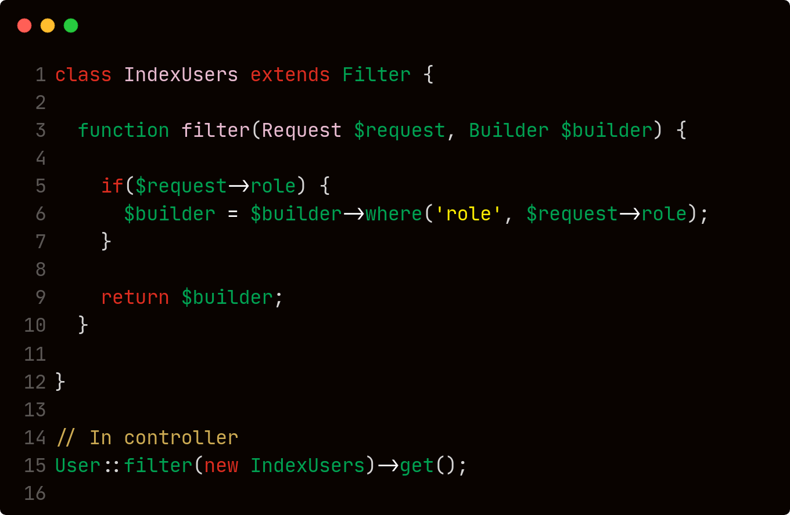

## Laravel Sieve 🧑🏾‍💻 🔍 🙂

---

The Sieve is a Laravel framework package to create query filters much more easy and clean.

<p style="text-align: center">

</p>

### How to use

---

install package with [Composer](https://getcomposer.org/)

```shell
composer install masoudi/laravel-sieve
```
